# Diagrams

Brand-styled diagrams with Mermaid, Graphviz, and similar tools. Values
derive from [data/brand.yml](../../data/brand.yml); if anything here
disagrees with the YAML, the YAML wins.

## General Rules

- Neutral-first: nodes are `neutral-50`/`neutral-100` surfaces with
  `neutral-300` borders and `neutral-800` text; color appears only to
  encode meaning.
- Lines and arrows: `neutral-400`.
- Emphasis/highlighted nodes: `blue-500` border or `blue-200` fill.
- Multi-category coloring follows the graph order: `blue-500`,
  `lightblue-500`, `purple-500`, `pink-500`, `orange-500`, `yellow-500`.
- Typography: Inter for labels, JetBrains Mono for code-like node content.

## Mermaid

```js
mermaid.initialize({
  theme: "base",
  themeVariables: {
    fontFamily: "Inter, system-ui, sans-serif",
    // Nodes
    primaryColor: "#F0F4FF",        // blue-100 fill for primary nodes
    primaryBorderColor: "#0A54FF",  // blue-500
    primaryTextColor: "#0E1017",    // neutral-800
    // Secondary/tertiary nodes
    secondaryColor: "#F7F8FA",      // neutral-100
    tertiaryColor: "#FDFDFE",       // neutral-50
    tertiaryBorderColor: "#CED3DE", // neutral-300
    // Lines and labels
    lineColor: "#959DB1",           // neutral-400
    textColor: "#0E1017",
    // Notes
    noteBkgColor: "#FEF6E1",        // yellow-200
    noteTextColor: "#0E1017",
    noteBorderColor: "#D09611",     // yellow-600
    // Pie/series charts
    pie1: "#0A54FF", pie2: "#0AADFF", pie3: "#CF0AFF",
    pie4: "#FF0AA5", pie5: "#FF5C0A", pie6: "#EDAE1D",
    background: "#FDFDFE",
  },
});
```

In Quarto or Markdown front ends, the same variables go under
`%%{init: {"theme": "base", "themeVariables": {...}}}%%`.

## Graphviz

```dot
digraph G {
  graph [bgcolor="#FDFDFE", fontname="Inter", fontcolor="#0E1017"];
  node [
    shape=box, style="rounded,filled",
    fillcolor="#F7F8FA", color="#CED3DE",
    fontname="Inter", fontcolor="#0E1017"
  ];
  edge [color="#959DB1", fontname="Inter", fontcolor="#414B62"];

  // Highlighted node
  important [fillcolor="#F0F4FF", color="#0A54FF"];
}
```



## Excalidraw / Hand-Drawn Tools

Stroke `neutral-800` (#0E1017), backgrounds from the 100/200-level tints,
emphasis in `blue-500` (#0A54FF). Use Inter (or the tool's closest
sans-serif) instead of handwriting fonts for anything official.
